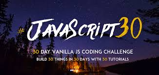

# Js-drumkit

The first project from Wes Bos's #javascript30

- Press the corresponding key on your keyboard
- It will play the sound associated with that key
- And it will play a really short animation to make the
  key a bit bigger with a yellow color. Adds a class of
  playing to the element (adds css scaling it up a little)

... a bit more

- When you press the key it will play the audio with the corresponding data-key eg '65'
- and it will add a class of playing to the key's div
